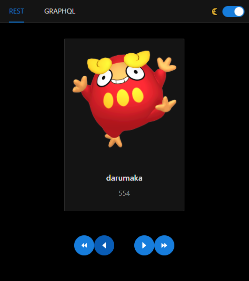

## Getting Started

### Prerequisites

```shell
## Use latest NPM 
$ npm i npm@latest -g

## Use latest NODEJS
$ nvm use lts

## Enable YARN from NODEJS
$ corepack enable

## Install latest version YARN
$ npm install --global yarn
```

## Installation

### YARN REACT TYPESCRIPT

```shell
## Install VITE with REACT template
yarn create vite vite-yarn-react-rtkq --template react-ts

$ cd vite-yarn-react-rtkq
$ yarn
```

```shell
## REACT-ROUTER-DOM
$ yarn add react-router-dom 
$ yarn add -D @types/react-router-dom
```

```shell
## ANT Design https://ant.design/docs/react/use-with-create-react-app#Install-and-Initialization
$ yarn add antd

## react-css-theme-switcher
$ yarn add react-css-theme-switcher
```

```shell
## Redux Toolkit
$ yarn add react-redux @reduxjs/toolkit
```

```shell
## GraphQL
yarn add @apollo/client graphql 
```

## Result

